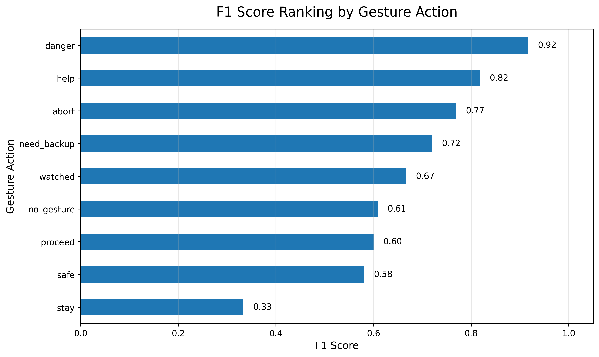
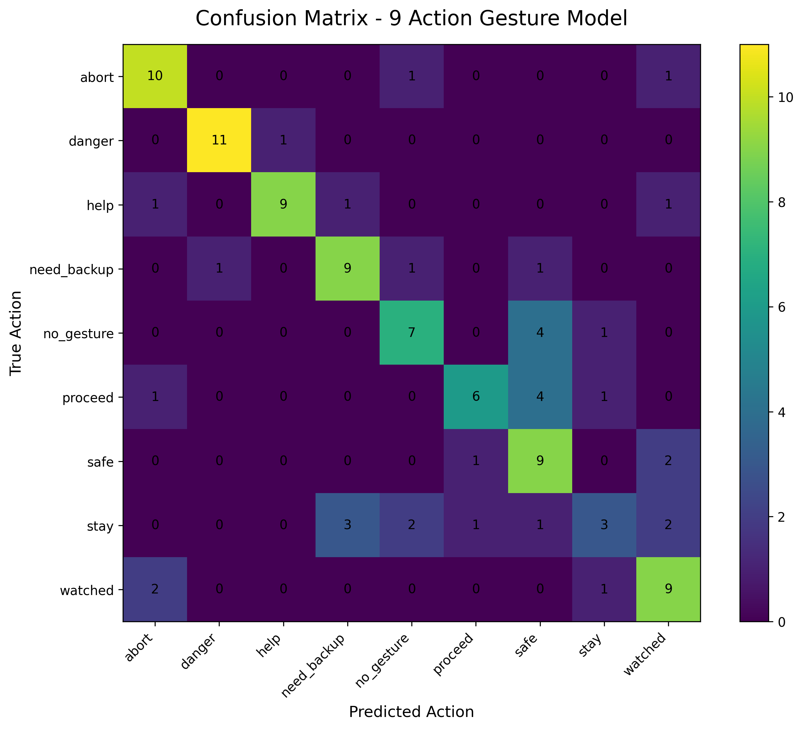

# 🚨 Silent Signal: Real-Time Emergency Gesture Recognition System

> **Motion BiLSTM · MediaPipe · Jetson Edge AI · Emergency Gesture Intelligence**


## 📌 Overview

**Silent Signal** is a real-time emergency gesture recognition system designed for situations where a person may need to communicate **without speaking**.

Imagine someone is being watched, recorded, monitored, or placed in a dangerous situation where speaking freely could make things worse. In that moment, the most important message may be the one they **cannot say out loud**.

This project turns silent physical gestures into actionable alerts using:

- 🎥 Custom-recorded gesture videos  
- 🧍 Face, hand, and upper-body keypoint extraction  
- 🧠 Motion BiLSTM sequence modeling  
- ⚡ Jetson Edge AI deployment concept  
- 🖥️ Real-time dashboard monitoring  

The goal is not just to train a model. The goal is to build a working prototype where **silent gestures become real-time emergency signals**.

---

## 🎬 Project Scenario

A person is visible on camera, but cannot speak freely.

They may be:

- Being watched  
- Captured on a video feed  
- Unable to safely communicate  
- Trying to send hidden emergency information  

In that scenario, a gesture becomes a message.

```text
Silent Gesture → Structured Keypoints → Motion BiLSTM → Real-Time Alert
```

---

## 🎯 Project Goal

The goal of this project is to build a real-time system that can recognize emergency-style gestures from video and convert them into readable alerts.

The system is designed to:

- Capture gesture video sequences
- Extract structured body, hand, and face keypoints
- Learn gesture movement patterns over time
- Predict emergency action classes
- Display predictions, confidence, logs, and alert levels
- Support Jetson-based edge deployment

---

## 🧩 Emergency Gesture Classes

The system recognizes **9 action classes**.

| Gesture | Meaning |
|---|---|
| 🚨 **Danger** | Emergency or threat detected |
| 🆘 **Help** | Person needs assistance |
| ✋ **Abort** | Stop or cancel current action |
| 🤝 **Need Backup** | Additional support required |
| ✅ **Safe** | Situation is safe |
| 🧍 **Stay** | Stay in place |
| ➡️ **Proceed** | Continue / move forward |
| 👀 **Watched** | Person feels monitored |
| ⚪ **No Gesture** | No intentional emergency signal |

These are not random labels. Each class represents a possible silent communication signal.

---

## 🧪 Dataset: “I Am the Data”


This project uses a **custom-recorded gesture dataset**.

Each gesture was recorded as a short video sequence. Instead of training directly on raw video frames, each clip was processed into structured keypoints using MediaPipe.

### Dataset Design

| Item | Description |
|---|---|
| Gesture Classes | 9 emergency action classes |
| Sequence Length | 30 frames per sequence |
| Input Type | Structured keypoints |
| Data Source | Custom recorded videos |
| Purpose | Personalized proof-of-concept |

This makes the model focus on **body structure and motion**, instead of being distracted by background, lighting, or room details.

---

## 👁️ What the System Sees

The model does not simply look at raw pixels.

The camera captures the person, then MediaPipe extracts meaningful landmarks:

- 🧑 **Face mesh landmarks**
- ✋ **Left and right hand landmarks**
- 🧍 **Upper-body pose keypoints**
- 🔁 **Frame-to-frame motion changes**

This matters because the system focuses only on the movement regions that are important for silent gesture recognition.

### Why Keypoints?

| Raw Pixels | Structured Keypoints |
|---|---|
| More background noise | Focused body movement |
| Heavier computation | Lightweight input |
| Harder to generalize | Easier motion tracking |
| Learns unnecessary visual details | Learns gesture structure |

---

## 🧠 Model: Motion BiLSTM Architecture

A gesture is not a single image.  
A gesture is a **motion pattern over time**.

That is why this project uses a **Motion BiLSTM** model.

### Model Pipeline

```text
Video Input
    ↓
MediaPipe Keypoints
    ↓
Selected Face + Pose + Hand Features
    ↓
Motion Delta Features
    ↓
Motion BiLSTM
    ↓
Gesture Class Prediction
```

### Why Motion BiLSTM?

A standard image model may understand what appears in one frame, but emergency gestures depend on movement.

For example:

- **Danger** may involve a hand-to-face movement
- **Help** may involve a distinct upper-body raise
- **Abort** may involve strong lateral motion
- **Stay** and **Proceed** may look similar unless timing is considered

The BiLSTM helps the system learn movement patterns across a full sequence, not just one frozen moment.

---

## 📊 Results: Model Performance


The model was evaluated using validation accuracy, test accuracy, F1-score, and confusion-based error analysis.

| Metric | Result |
|---|---:|
| Best Validation Accuracy | **76.85%** |
| Test Accuracy | **67.59%** |
| Action Classes | **9** |

The result shows that the model is learning meaningful patterns, especially for emergency gestures with clearer movement signatures.

This project is not only about one accuracy number. The stronger achievement is the full pipeline:

```text
Recorded Data → Extracted Keypoints → Trained Temporal Model → Tested Results → Jetson Demo → Dashboard Monitoring
```

---

## 📈 F1 Score by Class




The stronger classes had clearer motion patterns. The weaker classes were more subtle or visually similar.

---

## 🔍 Stability & Error Analysis

Accuracy alone does not prove that an emergency system is reliable.

That is why this project also looks at class-level stability using:

- Precision
- Recall
- F1-score
- Confusion matrix
- Detection behavior



### Stronger Classes

| Class | Why It Performed Better |
|---|---|
| 🚨 Danger | Clear hand-to-face pattern |
| 🆘 Help | Distinct upper-body raise |
| ✋ Abort | Strong lateral motion |
| 🤝 Need Backup | Unique hand posture / twist |

### Weaker Classes

| Class | Challenge |
|---|---|
| 🧍 Stay | Subtle motion; overlaps with Help |
| ✅ Safe | Low motion delta signature |
| ➡️ Proceed | Timing and frame ambiguity |
| ⚪ No Gesture | No clear intentional movement |

This is important because in emergency-style AI, the system should not blindly trust one prediction. It needs confidence, logs, and safety logic around the model output.

---

## 🖥️ Dashboard Prototype


The dashboard turns the model from a notebook experiment into a usable monitoring prototype.

The interface is designed to show:

- 🎥 Live camera feed
- 🧠 Current detected action
- 📊 Confidence score
- 🚦 Alert level indicator
- 🧩 Landmark visibility status
- 📝 Recent detection logs
- ✅ SAFE override timer

The model gives the prediction, but the dashboard gives the operator context.

---

## ⚡ Jetson Edge AI Deployment

This project is designed with Jetson-based edge deployment in mind.

The Jetson side handles:

- Real-time camera input
- MediaPipe keypoint extraction
- Gesture prediction
- Lightweight live inference

The dashboard side provides:

- Monitoring interface
- Confidence tracking
- Alert visibility
- Detection history
- SAFE override display

Together, they form a working prototype for real-time silent-signal monitoring.

---

## ✅ SAFE Override Logic

One important system-level feature is the **SAFE eye-closure override**.

Since some gesture classes are subtle, a rule-based safety layer can help reduce confusion. For example, if the eyes remain closed for around two seconds, the system can trigger or confirm the SAFE state.

This adds responsibility to the system design:

> The model predicts, but the system verifies with context.

---

## 📁 Repository Structure

```text
.
├── README.md
├── requirements.txt
├── .gitignore
│
├── notebooks/
│   └── Silent_Signal_Training.ipynb
│
├── src/
│   ├── extract_keypoints.py
│   ├── train_bilstm.py
│   ├── predict_gesture.py
│   └── dashboard_app.py
│
├── models/
│   └── motion_bilstm_model.pth
│
├── results/
│   ├── confusion_matrix.png
│   ├── f1_score_by_class.png
│   └── model_performance.png
│
├── visuals/
│   ├── keypoint_grid_1.png
│   ├── keypoint_grid_2.png
│   ├── model_pipeline.png
│   ├── dashboard_screenshot.png
│   └── banner.png
│
├── demo/
│   └── silent_signal_demo.mp4
│
└── docs/
    └── Bandi_Silent_Signal_Presentation.pptx
```

---

## 🛠️ Technologies Used

| Category | Tools |
|---|---|
| Programming | Python |
| Computer Vision | OpenCV, MediaPipe |
| Deep Learning | PyTorch |
| Modeling | Motion BiLSTM |
| Data Processing | NumPy, Pandas |
| Evaluation | Scikit-learn, Matplotlib |
| Dashboard | Flask / Web Dashboard |
| Edge AI | NVIDIA Jetson |

---

## 🚀 How to Run

### 1. Clone the repository

```bash
git clone https://github.com/your-username/silent-signal-gesture-recognition.git
cd silent-signal-gesture-recognition
```

### 2. Install dependencies

```bash
pip install -r requirements.txt
```

### 3. Extract keypoints

```bash
python src/extract_keypoints.py
```

### 4. Train the Motion BiLSTM model

```bash
python src/train_bilstm.py
```

### 5. Run gesture prediction

```bash
python src/predict_gesture.py
```

### 6. Launch dashboard

```bash
python src/dashboard_app.py
```

---

## 🎥 Demo


The demo shows the full pipeline:

```text
Live / recorded gesture input
        ↓
MediaPipe landmark extraction
        ↓
Motion BiLSTM classification
        ↓
Dashboard alert output
```

If the demo video is included, it can be found here:

[🎬 Watch Demo Video](demo/silent_signal_demo.mp4)

---

## 🧠 Key Project Insight

The most important insight from this project is that emergency gesture recognition is not only a classification problem.

It is a complete system problem.

A useful silent-signal system needs:

- Reliable feature extraction
- Temporal movement modeling
- Class-level error analysis
- Real-time interface design
- Confidence-aware alerts
- Safety override logic
- Edge deployment planning

That is what this project demonstrates.

---

## ⚠️ Limitations

This project is currently a proof-of-concept.

Current limitations include:

- Personalized dataset
- Limited number of users
- Similar gesture confusion
- Camera angle sensitivity
- Lighting dependency
- MediaPipe dependency
- Edge deployment constraints
- Weaker performance on subtle classes like Stay, Safe, Proceed, and No Gesture

---

## 🔮 Future Improvements

### 1. Scale the Dataset

Add more:

- Users
- Lighting conditions
- Camera angles
- Gesture variations
- Background environments

This will help the model generalize beyond one recording style.

### 2. Improve Weak Classes

Focus on:

- Stay
- Safe
- Proceed
- No Gesture

These classes need targeted data collection and class-specific augmentation.

### 3. Optimize Edge Deployment

Improve real-time performance using:

- Model compression
- Quantization
- Faster keypoint extraction
- Jetson pipeline optimization
- Dashboard-streaming improvements

### 4. Add Multi-Person Testing

Future versions can test whether the system works across different people, body types, and gesture speeds.

---

## 🏁 Conclusion

Silent Signal demonstrates how camera-based AI can turn silent physical gestures into real-time emergency alerts.

The key achievement is not only model accuracy. The key achievement is connecting multiple parts into one working prototype:

```text
Custom Data
   ↓
MediaPipe Keypoints
   ↓
Motion BiLSTM
   ↓
Jetson Demo
   ↓
Dashboard Alert System
```

This project is the starting point for a more generalized silent-signal recognition system that could support emergency response, safety monitoring, and voice-free communication.

---

## 🙋 Author

**Venu Bandi**  
MPS Data Science · UMBC  

Project Theme:  
**Silent Gesture → Actionable Alert**

---

## 📌 Presentation

The project presentation is available in the `docs/` folder:

[📑 Silent Signal Presentation](docs/Bandi_Silent_Signal_Presentation.pptx)

---

## ⭐ Final Message

> In an emergency, silence should not mean no communication.  
> Silent Signal turns movement into meaning.
